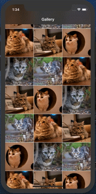
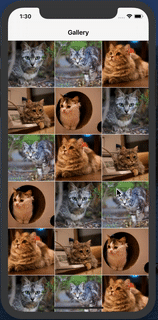
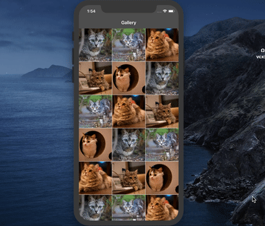

ImageViewer.swift
=======================

An easy to use Image Viewer that is inspired by Facebook

[](https://cocoapods.org/pods/ImageViewer.swift)
[](https://github.com/michaelhenry/ImageViewer.swift/actions)
[](https://cocoapods.org/pods/ImageViewer.swift)
[](https://cocoapods.org/pods/ImageViewer.swift)




# Supports

- From iOS 10
- Swift versions
	- Swift 4.0
	- Swift 4.2
	- Swift 5.0

## Installation

### CocoaPods

Using [cocoapods](https://cocoapods.org)

```ruby
pod 'ImageViewer.swift', '~> 3.0'
```

If you need remote image fetching:

```ruby
pod 'ImageViewer.swift', '~> 3.0'
pod 'ImageViewer.swift/Fetcher', '~> 3.0'
```

### Carthage

[Carthage](https://github.com/Carthage/Carthage) is a decentralized dependency manager that builds your dependencies and provides you with binary frameworks. To integrate Alamofire into your Xcode project using Carthage, specify it in your `Cartfile`:

```ogdl
github "michaelhenry/ImageViewer.swift" ~> 3.2
```

## How to use it

The simplest way to to use this is by using the [imageView.setupImageViewer()](https://github.com/michaelhenry/MHFacebookImageViewer/blob/master/Example/Demo/BasicViewController.swift#L11)


```swift
imageView.setupImageViewer()
```

Example:

```swift
import ImageViewer_swift

let imageView = UIImageView()
imageView.image = UIImage(named: 'cat1')
...
imageView.setupImageViewer()
```

Or you might load it from a URL

```swift
imageView.setupImageViewer(url: URL(string: "https://example.com/image.jpg")!)
```

Or you might load it with an array of images `[UIImage]`

```swift
let images = [
    UIImage(named: "cat1"),
    UIImage(named: "cat1"),
    UIImage(named: "cat1")
]
imageView.setupImageViewer(images: images)
```

Or you might load it with an array of URL `[URL]`

```swift
let urls = [
    URL(string: "https://example.com/your-image-1.jpg")!,
    URL(string: "https://example.com/your-image-2.jpg")!,
    URL(string: "https://example.com/your-image-3.jpg")!
]
imageView.setupImageViewer(urls: urls)
```

### How to change the layout or options that are available

You can check this file [ImageViewerOption.swift](https://github.com/michaelhenry/ImageViewer.swift/blob/master/Sources/ImageViewerOption.swift) to see what are the available options that will fit to your needs.

```swift
public enum ImageViewerOption {
    case theme(ImageViewerTheme)
    case closeIcon(UIImage)
    case rightNavItemTitle(String, onTap: ((Int) -> Void)?)
    case rightNavItemIcon(UIImage, onTap: ((Int) -> Void)?)
}
```


You could also check the [Demo](Example) Project for more information.


### Easy peasy :)

Please let me know if you have any questions.

Cheers,
[Michael Henry Pantaleon](http://www.iamkel.net)

Twitter: [@michaelhenry119](https://twitter.com/michaelhenry119)

Linked in: [ken119](http://ph.linkedin.com/in/ken119)

http://www.iamkel.net


# Dependency

- [SDWebImage](https://github.com/SDWebImage/SDWebImage), for downloading and caching images.


# License

MIT

Copyright (c) 2013 Michael Henry Pantaleon (http://www.iamkel.net). All rights reserved.

Permission is hereby granted, free of charge, to any person obtaining a copy of this software and associated documentation files (the "Software"), to deal in the Software without restriction, including without limitation the rights to use, copy, modify, merge, publish, distribute, sublicense, and/or sell copies of the Software, and to permit persons to whom the Software is furnished to do so, subject to the following conditions:

The above copyright notice and this permission notice shall be included in all copies or substantial portions of the Software.

THE SOFTWARE IS PROVIDED "AS IS", WITHOUT WARRANTY OF ANY KIND, EXPRESS OR IMPLIED, INCLUDING BUT NOT LIMITED TO THE WARRANTIES OF MERCHANTABILITY, FITNESS FOR A PARTICULAR PURPOSE AND NONINFRINGEMENT. IN NO EVENT SHALL THE AUTHORS OR COPYRIGHT HOLDERS BE LIABLE FOR ANY CLAIM, DAMAGES OR OTHER LIABILITY, WHETHER IN AN ACTION OF CONTRACT, TORT OR OTHERWISE, ARISING FROM, OUT OF OR IN CONNECTION WITH THE SOFTWARE OR THE USE OR OTHER DEALINGS IN THE SOFTWARE.
